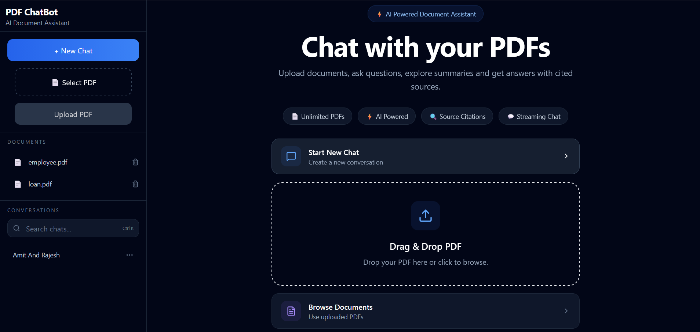
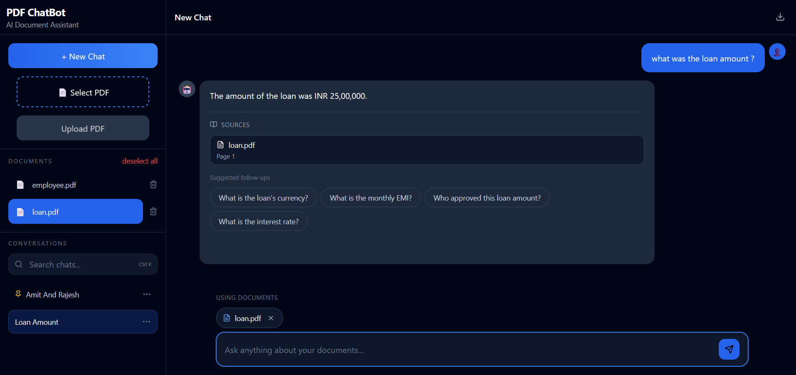
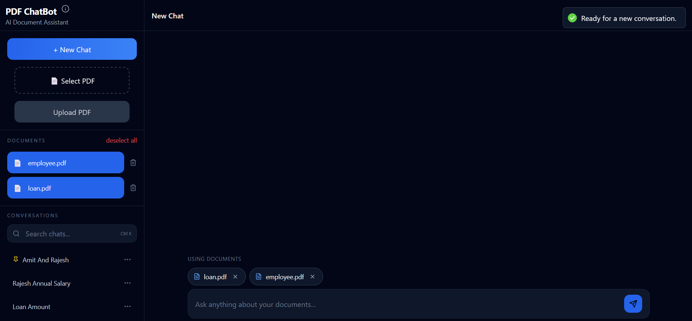
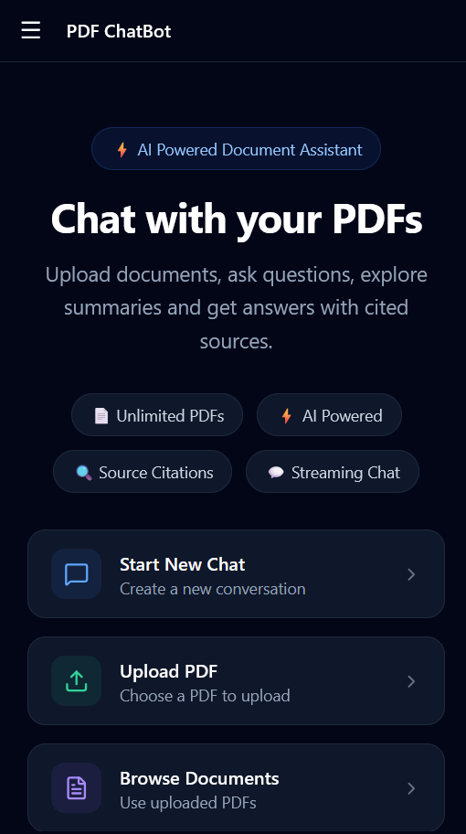
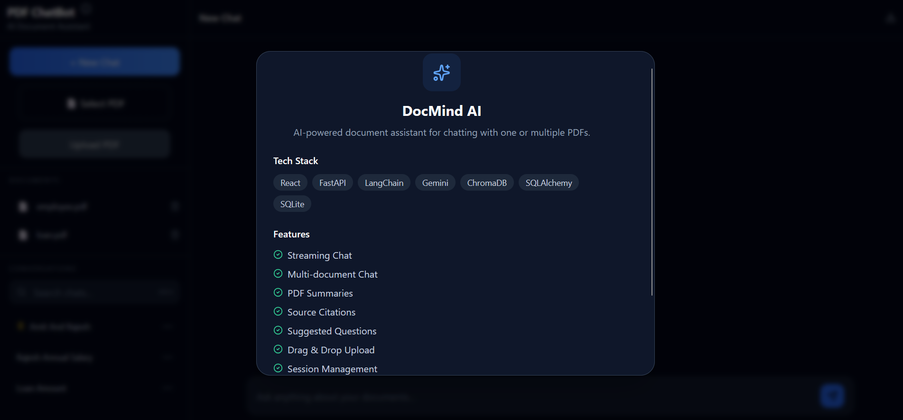

# DocMind AI – Frontend


A modern React frontend for **DocMind AI**, an AI-powered document assistant that enables users to upload, manage, summarize, and chat with one or multiple PDF documents using **Retrieval-Augmented Generation (RAG)**.

Built with **React**, **Vite**, **Tailwind CSS**, and **Axios**.

---

## 🌐 Live Demo

**Frontend:**  
https://docmindai-lake.vercel.app

**Backend API:**  
https://docmindai-r0xj.onrender.com

**Backend Repository:**  
https://github.com/ImOmkar/pdf-chatbot

---

## 📸 Screenshots

<table>
<tr>
<td align="center">

### Welcome Screen



</td>

<td align="center">

### Chat Interface



</td>
</tr>

<tr>
<td align="center">

### Multi-Document Selection



</td>

<td align="center">

### Mobile View



</td>
</tr>

<tr>
<td colspan="2" align="center">

### About Dialog



</td>
</tr>
</table>

---

# ✨ Features

## 📄 Document Management

- Upload PDF documents
- Drag & Drop upload
- Multi-document selection
- Remove individual selected documents
- Document summaries
- Browse uploaded PDFs
- Delete uploaded documents

---

## 💬 AI Chat Experience

- AI-powered conversations with PDFs
- Chat with multiple documents simultaneously
- Streaming AI responses
- Source citations with page references
- Suggested follow-up questions
- Regenerate responses
- Stop response generation
- Export conversations

---

## 📂 Session Management

- Create new chats
- Rename conversations
- Pin / Unpin sessions
- Delete sessions
- Search conversations
- Persistent chat history

---

## 🎨 User Experience

- Responsive desktop & mobile UI
- Independent sidebar and chat scrolling
- Mobile Bottom Sheets
- Desktop Modals
- Beautiful dark theme
- Drag & Drop overlay
- Loading indicators
- Confirmation dialogs
- About dialog
- Keyboard-friendly interactions

---

# 🛠 Tech Stack

- React
- Vite
- Tailwind CSS
- Axios
- Lucide React
- React Markdown
- Server-Sent Events (Streaming)

---

# 🏗 Project Structure

```text
src/
├── assets/
├── components/
├── pages/
├── services/
...
```

---

# 🚀 Getting Started

## Clone Repository

```bash
git clone https://github.com/ImOmkar/pdf-chatbot-frontend.git

cd pdf-chatbot-frontend
```

## Install Dependencies

```bash
npm install
```

## Configure Environment Variables

Create a `.env` file.

```env
VITE_API_URL=http://localhost:8000
```

## Run Development Server

```bash
npm run dev
```

Application will be available at:

```text
http://localhost:5173
```

---

# 🌐 Production Build

```bash
npm run build
```

Preview production build:

```bash
npm run preview
```

---

# 🔗 Backend

This frontend communicates with the **DocMind AI Backend**, built using:

- FastAPI
- LangChain
- Google Gemini
- ChromaDB
- SQLAlchemy
- SQLite

Backend Repository:

https://github.com/ImOmkar/pdf-chatbot

---

# 🎯 Highlights

- Modern responsive UI
- Multi-document Retrieval-Augmented Generation (RAG)
- Streaming AI responses
- Source-grounded answers
- Mobile-first experience
- Reusable component architecture
- Clean API integration
- Production deployment on Vercel

---

# 🚀 Future Improvements

- Authentication & user accounts
- Cloud file storage (AWS S3)
- PostgreSQL support
- OCR for scanned PDFs
- Highlight cited text inside PDFs
- Conversation sharing
- Dark / Light theme toggle

---

# 📄 License

This project is developed for **learning and portfolio purposes**.

---

# 👨‍💻 Author

**Omkar Parab**

If you found this project interesting, feel free to ⭐ the repository and explore the backend implementation as well.